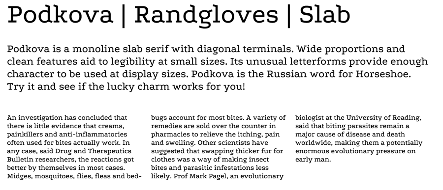

# Podkova fonts

Open-source font by Ilya Yudin for Cyreal

Podkova is a monoline slab serif with diagonal terminals. Wide proportions and clean features aid to legibility at small sizes. Its unusual letterforms provide enough character to be used at display sizes. Podkova is the Russian word for Horseshoe. Try it and see if the lucky charm works for you!

## Changelog v.2.100

- [x] Expand to GF Cyrillic Pro, GF Latin Pro
- [x] Generate styles:
	* 400 Regular
	* 500 Medium
	* 600 SemiBold
	* 700 Bold
	* 800 ExtraBold

#### Supported glyphs sets:

* GF Latin Pro
* GF Cyrillic Pro

## License

This Font Software is licensed under the SIL Open Font License, Version 1.1.
This license is copied below, and is also available with a FAQ at:
http://scripts.sil.org/OFL

## Copyright

Copyright (c) 2011 the Podkova Project authors (contact@cyreal.org).

## Links

* [Podkova on Google Fonts](1)

[1]: https://fonts.google.com/specimen/Podkova